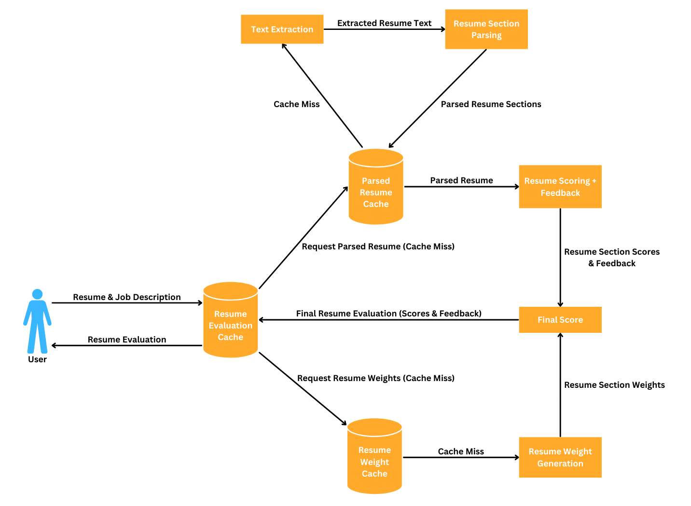

# AI Resume Scanner

A simple LLM-powered tool that evaluates how well your resume matches a job description and provides feedback to improve your resume.

## Table of Contents

- [AI Resume Scanner](#ai-resume-scanner)
  - [Table of Contents](#table-of-contents)
  - [Features](#features)
  - [Live Demo](#live-demo)
  - [How It Works](#how-it-works)
    - [Resume Parsing](#resume-parsing)
    - [Resume Section Evaluation](#resume-section-evaluation)
    - [Weight Generation](#weight-generation)
    - [Overall Scoring](#overall-scoring)
  - [Technical Documentation](#technical-documentation)
    - [Data Flow Diagram](#data-flow-diagram)
    - [Tech Stack](#tech-stack)
  - [Getting Started](#getting-started)
    - [Prerequisites](#prerequisites)
    - [Installation](#installation)

## Features

- **Web-Based Access:** access the entire application through your web browser
- **Job-Specific Matching:** matches a provided resume against a job description and evaluates the fit based on the job's unique requirements.
- **Tailored Feedback:** provides comprehensive feedback on each resume's strengths and weaknesses in relation to a specific job description.
- **Quantitative Scoring Metric:** assigns a score between 0 and 100 for each resume, where 100 indicates a perfect fit between the resume and job description. 

## Live Demo

https://github.com/user-attachments/assets/9e4310c9-c998-414e-b4b8-0cc28acac74a

## How It Works

### Resume Parsing

A dedicated parsing module uses both LLMs and traditional OCR and regex to parse resumes with high accuracy.

- Supports both image-based and text-based PDF uploads
- Automatically parses section information (Education, Experience, Skills, etc.) into structured JSON
- Parsed resumes are cached with **Redis**, so future requests can bypass the parsing module

### Resume Section Evaluation

After parsing, the scoring module uses an LLM to score resumes against a job description (100-point scale) on six key aspects:

- Education
- Work Experience
- Skills
- Projects
- Leadership (if present)
- Research (if present)

If a section is not present, it receives a 0; however, depending on the job description, receiving a 0 may not negatively impact the final score (see [Weight Generation](#weight-generation) and [Overall Scoring](#overall-scoring)).

Along with scores, the LLM also outputs human-interpretable feedback justifying each section's score in its JSON outputs. A sample output might look like:

```
"experience": {
    "relevance": 4,
    "depth": 4,
    "impact": 4,
    "comment": "The candidate has relevant experience in machine learning and software development, which aligns well with the internship's focus on technology and programming. The contributions demonstrate substantial work on real-world projects, particularly in AI and web development, which are valuable for the role."
},
"education": {
    "alignment": 5,
    "comment": "The candidate is pursuing a Bachelor of Science in Computer Science with a strong GPA and relevant coursework, meeting the educational requirements for the internship."
},
...other sections below...
```

**Note:** the output from this stage is also cached with Redis. If a user provides the same resume/job description combination twice, the second request will serve the cached evaluation instantly.

### Weight Generation

The weight generation module generates a set of relative weights for each resume section based on the provided job description. For example, for jobs emphasizing prior work experience, the "Work Experience" section would receive a high relative weight. A sample set of weights might be:

```
- Education: 0.2
- Work Experience: 0.5
- Skills: 0.1
- Projects: 0.15
- Leadership: 0.05
- Research: 0
```

**Note:** all the weights generated add up to 1, which ensures the final output in the next step falls between 0 and 1.
  
### Overall Scoring

Each resume receives a final score based on the following formula. 

```
Final Score = sum(Section Score * Section Weight)

Where:
- Section Score = score out of 100 for each resume section
- Section Weight = dynamically generated weight between 0 and 1
- Final Score = score between 0 and 100
```

## Technical Documentation

### Data Flow Diagram



### Tech Stack

- **Frontend:** Vite + React.js + TailwindCSS
- **Backend:** FastAPI
- **Parsing Module:** Pytesseract + re + OpenAI (structured outputs)
- **Scoring Module:** Ollama/OpenAI
- **GraphQL:** Strawberry (server) + Apollo Client (client) + GraphQL Codegen
- **Cache:** Redis
- **Containerization:** Docker

## Getting Started

### Prerequisites

- Docker (v27)
- OpenAI API Key

### Installation

1. Clone the repository

```bash
git clone git@github.com:N1v3x2/resume-scanner.git
cd resume-scanner
```

2. `cd` into `/backend` and create a `.env` file containing your OpenAI API key as the only environment variable

```dotenv
OPENAI_API_KEY=<your API key>
```

3. `cd` back to the root directory and start Docker Compose

```bash
docker compose up
```

4. Visit `http://localhost:8080` to see the application running.
